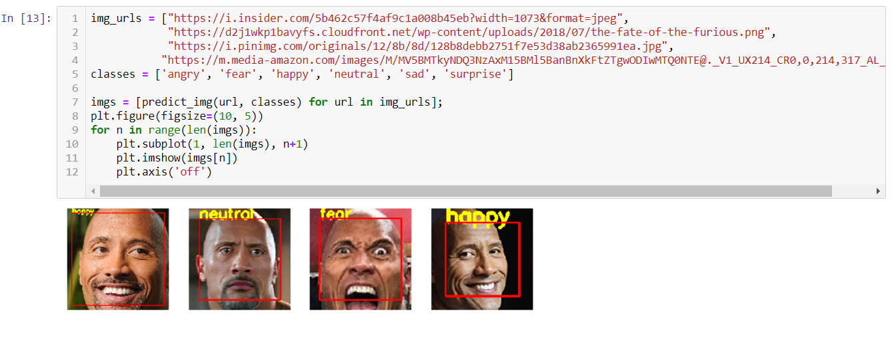

# Facial-Expression-Recognition
Recognizing happiness, fearness, sadness, anger and surprising facial expressions with keras api.
using OpenCV to automatically detect faces in images and draw bounding boxes around them as well as
performing real-time facial expression recognition with webcam.

##### Repo:
- loading and preparing the data and building the model (Facial_Expression.ipynb)  
- reading the webcam and predicting every frame (camera.py)  
- loading and intializing the model (model.py)  
- connecting to a localhost and running the program (main.py)  

### Dataset link:
https://www.kaggle.com/ashishpatel26/fer2018

### Example:

